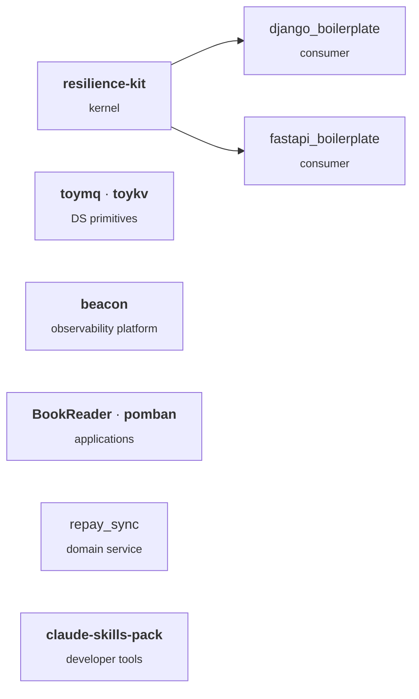

### Hi, I'm Prajwal 👋

Senior backend engineer (Bengaluru) — distributed fintech, robotics, and AI-integrated platforms. I build resilience kernels, push correctness invariants into Postgres, and ship LLM-powered services in production.

**Currently** — Lead architect at [Optimo Capitals](https://optimocapital.in/): 8 of 14 internal services shipped in the last 10 months. OptiView dashboard platform, the 5-service co-lending mesh (sole author of 4 of 5 repos), three AWS Lambda services, AA-consent pipeline. Platform-wide since the resilience-kernel rollout: latency came down hard, DB load came down harder, and uptime moved from "good enough" to "boring" — the shape of the work is open-sourced as [`resilience-kit`](https://github.com/prajwalmahajan101/resilience-kit).

**Previously** — Backend lead at Viamagus on **Quason** (VDA 5050 fleet backbone — 100+ AMRs at ~10k msgs/sec, zero observed message loss in production) and **Synthia** (RAG legal assistant with a Word plugin agent on GPT-4).

#### What I work on

- **Resilience kernels** — circuit breakers, retries with backoff + jitter, idempotency, tiered rate limiting, DLQs
- **Postgres-enforced invariants** — CHECK constraints, BEFORE INSERT/UPDATE triggers, durable-id dedupe, declarative migrations
- **LLM platforms** — RAG pipelines, structured document extraction, Bedrock / Ollama / GPT-4 routing
- **Security at the lowest layer** — SSRF guards, HMAC + nonce webhooks, Fernet field crypto, fail-closed boot, audit logging

#### How it fits together

#### Building in public

> _Cadence: episodic — concentrated weekday-evening sessions (Tue / Fri dominant, with occasional full-day pushes), not weekends. The public surface ships in bursts; the day job is full-time. Silent stretches mean shipping elsewhere, not stalled._

**Libraries** *(the thesis — everything else consumes these)*
- [`resilience-kit`](https://github.com/prajwalmahajan101/resilience-kit) — framework-agnostic Python resilience + core-infra kernel · retries, circuit breakers, throttles, cache, SSRF guard, DNS-pinned HTTP client, audit decorators, field crypto · pluggable backends · adapters for Django + FastAPI · stable [`v0.1.0`](https://github.com/prajwalmahajan101/resilience-kit/releases/tag/v0.1.0) on PyPI · [write-up on dev.to](https://dev.to/prajwalmahajan101/building-resilience-kit-a-python-resilience-kernel-forged-in-production-5973)

**Distributed systems learning track** *(building the bottom of the stack from scratch in Go)*
- [`toymq`](https://github.com/prajwalmahajan101/toymq) — single-node persistent message broker · append-only WAL with CRC framing, per-message fsync, at-least-once delivery, crash recovery · [`v1.3.0`](https://github.com/prajwalmahajan101/toymq/releases/tag/v1.3.0) adds Prometheus + OpenTelemetry observability · [write-up on dev.to](https://dev.to/prajwalmahajan101/building-toymq-a-from-scratch-persistent-message-broker-in-go-ob7)
- [`toykv`](https://github.com/prajwalmahajan101/toykv) — single-node in-memory KV store · companion to `toymq` · at milestone [`m4`](https://github.com/prajwalmahajan101/toykv/tree/m4) — RESP2 codec, in-memory store with concurrent-safe INCR, AOF persistence, TTL with lazy + sweep eviction · CLI + TUI next

**Platforms**
- [`beacon`](https://github.com/prajwalmahajan101/beacon) — self-hosted OpenTelemetry-native observability platform (logs / traces / metrics) · Kafka buffer, polyglot storage (Elasticsearch + wide-column NoSQL + TSDB), React console, Java + Python SDKs · M0 ([`v0.1-m0`](https://github.com/prajwalmahajan101/beacon/releases/tag/v0.1-m0)) freezes the JSON Schema + multi-language conformance suite before any SDK code · Java SDK in flight (M1.0/M1.1 shipped: Logback appender, OTLP exporter, retry policy, bounded buffer, batch flusher, redactor, canonical-JSON serializer, OTel severity mapper; conformance C1/C12 re-enabled)
- [`BookReader`](https://github.com/prajwalmahajan101/BookReader) — terminal EPUB reader and personal library (Textual, SQLite-backed) · inline kitty / iTerm2 / WezTerm / sixel images, two-page mode, per-book bookmarks + stats, collections + wishlist · stable [`v1.0.0`](https://github.com/prajwalmahajan101/BookReader/releases/tag/v1.0.0) with a [docs site](https://prajwalmahajan101.github.io/BookReader/) · `pipx install bookreader-tui`
- [`pomban`](https://github.com/prajwalmahajan101/pomban) — keyboard-driven Pomodoro TUI with kanban board + stats heatmap, themes, hooks, plugins (Textual) · [`v0.3.0`](https://github.com/prajwalmahajan101/pomban/releases/tag/v0.3.0)

**Starters & services**
- [`fastapi_boilerplate`](https://github.com/prajwalmahajan101/fastapi_boilerplate) — production-shaped FastAPI + async SQLAlchemy starter · consumes `resilience-kit` v0.1.0 · stable [`v1.0.0`](https://github.com/prajwalmahajan101/fastapi_boilerplate/releases/tag/v1.0.0) · Redis-backed resilience, SSRF-safe HTTP, request-id audit log, security middleware, Alembic, Docker
- [`django_boilerplate`](https://github.com/prajwalmahajan101/django_boilerplate) — production-shaped Django 6 + DRF starter · consumes `resilience-kit` v0.1.0 · first tagged [`v0.1.0`](https://github.com/prajwalmahajan101/django_boilerplate/releases/tag/v0.1.0) · typed exceptions, structured response envelopes, JWT + OAuth, Valkey throttles, AWS Secrets Manager overlay, Docker
- [`repay_sync`](https://github.com/prajwalmahajan101/repay_sync) — Django 5 + DRF loan-collection service · audit-logged mutations, agent-officer assignment, call / field-visit interactions with PTP / Refused / Partial dispositions, JWT, MPTT

**Developer tools**
- [`claude-skills-pack`](https://github.com/prajwalmahajan101/claude-skills-pack) — bundle of three [Claude Code](https://claude.com/claude-code) skills, each independently installable · **sb** (persistent second-brain — captures Claude Code conversations into an Obsidian vault, analyzes them into lessons / kanban / topics / cross-project connections; 22 `/sb:*` commands, 5 hooks) · **code_assist** (atomic git commits, stack-aware code reviews, phase-journal entries; 7 commands, 3 subagents) · **unabridged** (forces complete, untruncated output)

**Up next** *(public repos forthcoming — target Q3 2026)*
- `tinyraft` — 3-node Raft cluster in Go
- `dbview` — multi-DB TUI in Bubble Tea
- Postgres tooling — declarative CHECK / triggers / durable-id idempotency as a Python library

<strong>Personal tooling</strong> — daily-driver dotfiles & editor config (not maintained as products)

- [`omarchy-abyss-glass`](https://github.com/prajwalmahajan101/omarchy-abyss-glass) — Hyprland dotfiles · glass-morphic waybar, layered window animations, multi-monitor wallpaper engine
- [`nvim_config`](https://github.com/prajwalmahajan101/nvim_config) — LazyVim setup tuned for backend work · ~60ms cold start
- [`VaultTemplate`](https://github.com/prajwalmahajan101/VaultTemplate) — Obsidian vault template for bootstrapping a notes workspace

#### Writing & web

- Long-form at [dev.to/prajwalmahajan101](https://dev.to/prajwalmahajan101) and [prajwalmahajan101.hashnode.dev](https://prajwalmahajan101.hashnode.dev) — backend, distributed systems, AWS · source markdown lives in [`blog-posts`](https://github.com/prajwalmahajan101/blog-posts) (split into `devto/` and `hashnode/`)
- [`portfolio`](https://github.com/prajwalmahajan101/portfolio) — personal site · [live](https://prajwalmahajan.in)

_Feed below is injected nightly from dev.to + Hashnode RSS; may go stale between writing bursts._

<!-- BLOG-POST-LIST:START -->
- 📝 **[Building resilience-kit: A Python Resilience Kernel Forged in Production](https://dev.to/prajwalmahajan101/building-resilience-kit-a-python-resilience-kernel-forged-in-production-5973)** · Jun 11, 2026
- 📝 **[Building toymq: a from-scratch persistent message broker in Go](https://dev.to/prajwalmahajan101/building-toymq-a-from-scratch-persistent-message-broker-in-go-ob7)** · Jun 9, 2026

<!-- BLOG-POST-LIST:END -->

#### Reach me

- Portfolio: https://prajwalmahajan.in
- LinkedIn: https://linkedin.com/in/prajwal-mahajan
- Email: prajwal.mahajan101@gmail.com
